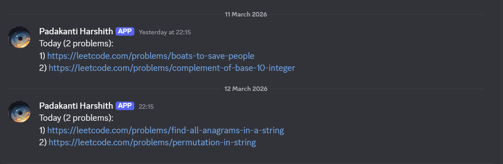

<div align="center">

# 🧠 LeetCode Discord Reporter

**Automatically tracks your daily LeetCode grind and posts it to Discord — every night, no PC needed.**


</div>

---

## 📖 Table of Contents

- [What It Does](#-what-it-does)
- [How It Works](#-how-it-works)
- [Screenshots](#-screenshots)
- [Tracking Window](#-tracking-window)
- [Setup Guide](#-setup-guide)
- [Project Structure](#-project-structure)
- [Customization](#-customization)
- [Cookie Refresh](#-cookie-refresh-every-2-weeks)
- [Troubleshooting](#-troubleshooting)
- [FAQ](#-faq)
- [Contributing](#-contributing)
- [Security Notes](#-security-notes)
- [Inspiration](#-inspiration)

---

## 🚀 What It Does

Every day at **10:15 PM IST**, this bot wakes up on GitHub's servers and:

- ✅ Fetches all LeetCode problems you solved that day
- 📬 Posts them directly to your Discord channel
- 💤 Requires **zero input from you** — PC can be completely off

### Example Discord Message

```
Today (3 problems):
1) https://leetcode.com/problems/find-unique-binary-string
2) https://leetcode.com/problems/find-the-smallest-balanced-index
3) https://leetcode.com/problems/minimum-operations-to-sort-a-string
```

> If you didn't solve anything, it posts: `No problems solved today`

---

##  How It Works

```
cron-job.org (10:15 PM IST)
        │
        ▼
GitHub Actions triggered via API
        │
        ▼
send.py runs on GitHub's servers
        │
        ▼
LeetCode GraphQL API queried
(authenticated with session cookies)
        │
        ▼
Accepted submissions from last 16 hours filtered
        │
        ▼
Discord Webhook → message posted
```

**Why session cookies?**
LeetCode blocks unauthenticated requests from cloud server IPs (like GitHub's). Using your browser session cookies authenticates the request and bypasses this block.

**Why cron-job.org?**
GitHub Actions' built-in cron scheduler can delay by up to 60 minutes on free accounts. cron-job.org triggers the workflow via GitHub's API at the exact time every night.

---

## 📸 Screenshots

### Discord Message


---

## ⏰ Tracking Window

The bot captures problems solved between **6:15 AM → 10:15 PM IST** daily.

Late night solves (after 10:15 PM) won't be included — keeping your daily log clean and honest.

---

##  Setup Guide

### Step 1 — Get Your LeetCode Cookies

> Your cookies authenticate the request so GitHub's servers aren't blocked by LeetCode.

1. Go to [leetcode.com](https://leetcode.com) and log in
2. Press `F12` → **Application** tab → **Cookies** → `https://leetcode.com`
3. Find and copy these two values:
   - `LEETCODE_SESSION`
   - `csrftoken`

### Step 2 — Create a Discord Webhook

1. Open your Discord server → right-click your channel → **Edit Channel**
2. Go to **Integrations** → **Webhooks** → **New Webhook**
3. Give it a name (e.g. `LeetCode Bot`) and copy the webhook URL

### Step 3 — Add GitHub Secrets

Go to your repo → **Settings** → **Secrets and variables** → **Actions** → **New repository secret**

| Secret | Value |
|--------|-------|
| `LEETCODE_USERNAME` | Your LeetCode username |
| `LEETCODE_SESSION` | Cookie from Step 1 |
| `LEETCODE_CSRF` | `csrftoken` from Step 1 |
| `DISCORD_WEBHOOK` | Webhook URL from Step 2 |

### Step 4 — Push the Code

Push the code to your repo. Then continue to Step 5 for reliable timing.

### Step 5 — Set Up cron-job.org (For Reliable Timing)

GitHub Actions cron can delay by up to 1 hour. Use cron-job.org to trigger it exactly on time.

1. Sign up free at [cron-job.org](https://cron-job.org)
2. Create a new cronjob with:
   - **URL:** `https://api.github.com/repos/YOUR_USERNAME/leetcode-discord-reporter/actions/workflows/YOUR_WORKFLOW_ID/dispatches`
   - **Schedule:** 10:15 PM IST (16:45 UTC)
   - **Method:** POST
   - **Headers:**
     - `Authorization` → `token YOUR_GITHUB_TOKEN`
     - `Accept` → `application/vnd.github.v3+json`
   - **Body:** `{"ref":"main"}`
3. Save and test

> ⚠️ To get your Workflow ID, open this URL in your browser:
> `https://api.github.com/repos/YOUR_USERNAME/leetcode-discord-reporter/actions/workflows`

### Step 6 — Done 🎉

Your bot will now post every night automatically. No PC needed.

---

## 📁 Project Structure

```
leetcode-discord-reporter/
├── assets/
│   └── discord-screenshot.png   # Discord bot output preview
├── send.py                    # Core script — fetches & posts submissions
├── LICENSE                    # MIT License
├── README.md                  # This file
└── .github/
    └── workflows/
        └── daily.yml          # Triggered by cron-job.org every night at 10:15 PM IST
```
---

## 🔧 Customization

### Change the posting time

Update the schedule in your [cron-job.org](https://cron-job.org) dashboard to your preferred time.

### Change the tracking window

Edit `send.py`:

```python
if now - sub_time < timedelta(hours=16):  # tracks from 6:15 AM IST
```

Increase or decrease the hours as needed.

### Change the number of submissions fetched

Edit the `limit` in `send.py`:

```python
"variables": {"username": username, "limit": 10}
```

Increase if you solve more than 10 problems a day.

---

## 🔄 Cookie Refresh (Every ~2 Weeks)

LeetCode session cookies expire. When the bot stops working:

1. Log in to leetcode.com → `F12` → Application → Cookies
2. Copy fresh `LEETCODE_SESSION` and `csrftoken` values
3. Update them in **GitHub → Settings → Secrets**

---

## 🐛 Troubleshooting

| Problem | Cause | Fix |
|---------|-------|-----|
| `No problems solved today` but you did solve | Cookies expired | Refresh `LEETCODE_SESSION` and `csrftoken` in GitHub Secrets |
| `KeyError: LEETCODE_SESSION` | Secret not added to yaml env | Add secret name to `env` block in `daily.yml` |

---

## ❓ FAQ

**Q: Does my PC need to be on?**
No. Everything runs on GitHub's servers triggered by cron-job.org.

**Q: Will it work if I don't solve anything?**
Yes. It posts `No problems solved today` so you still get a daily reminder.

**Q: How long do cookies last?**
Around 2 weeks. You'll need to refresh them when the bot stops working.

**Q: Can I use this for Codeforces too?**
Not currently. Only LeetCode is supported.

**Q: Is my data safe?**
Yes. All sensitive values are stored as GitHub Secrets and never exposed in code or logs.

**Q: What if I solve more than 10 problems in a day?**
Increase the `limit` value in `send.py` from `10` to a higher number.

---

## 🤝 Contributing

Contributions are welcome! If you have ideas to improve this:

1. Fork the repo
2. Create a new branch: `git checkout -b feature/your-feature`
3. Make your changes
4. Commit: `git commit -m "Add your feature"`
5. Push: `git push origin feature/your-feature`
6. Open a Pull Request

### Ideas for contribution
- Add Codeforces support
- Add problem difficulty in the Discord message
- Add weekly summary report
- Add streak tracking

---

## 🔒 Security Notes

- ✅ All sensitive values are stored as **GitHub Secrets** — never in code
- ⚠️ If your Discord webhook URL leaks, regenerate it immediately:
  `Discord → Channel Settings → Integrations → Webhooks → Regenerate URL`
- ⚠️ Never commit cookies directly into your repo
- ⚠️ Never share your GitHub Personal Access Token publicly

---

## 💡 Inspiration

In class one day, our sir mentioned a student from another campus who had built something really cool — a script on his local PC that sent his daily LeetCode solved problem links to the college Discord server (where we're supposed to post daily) with just a single button click. Sir was genuinely impressed, said he only found out about it a few days later.

That story stayed with me. I took that same idea and pushed it a step further — no button, no local PC. Mine just runs automatically every night at 10:15 PM and posts on its own, whether my PC is on or not.

Respect to that guy for the inspiration. 🙏

---

<div align="center">

Built with 💪 to keep the grind accountable.

</div>
